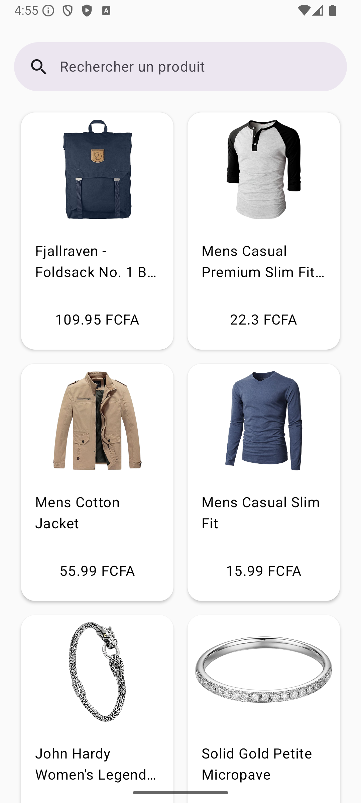
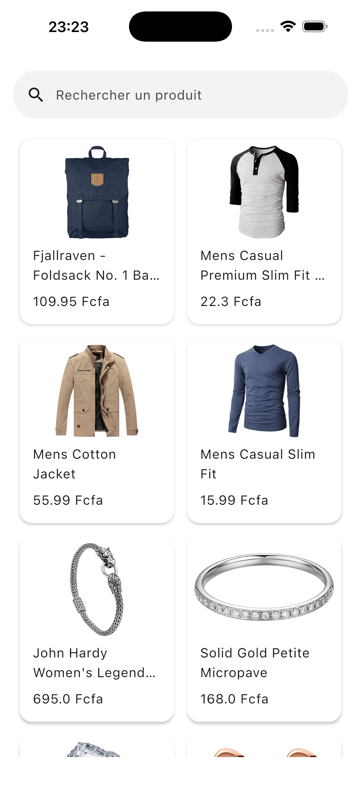
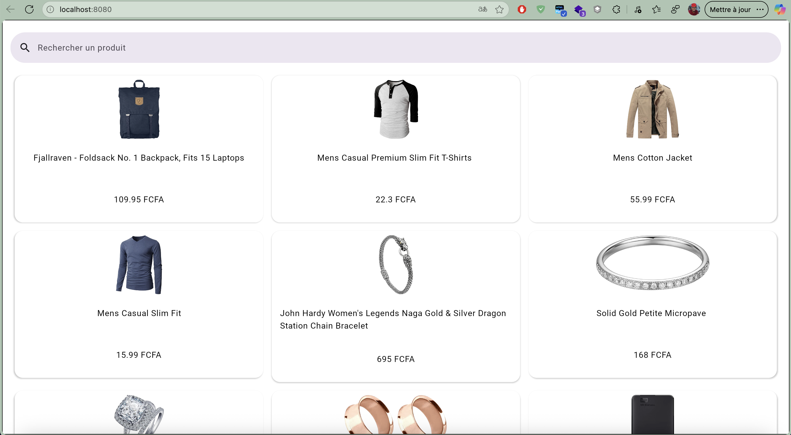
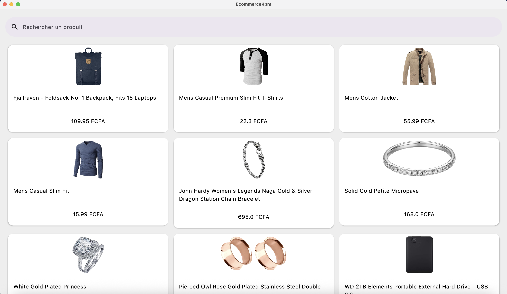

# 🚀 Projet Kotlin Multiplatform

Ceci est un projet **Kotlin Multiplatform** ciblant **Android, iOS, Web, Desktop (JVM)**.

<p align="center">
  
</p>

## 📱 Captures d’écran

### Android


### iOS


### Web


### Desktop


---

## 📂 Structure du projet

* [/composeApp](./composeApp/src) contient le code partagé entre vos applications Compose Multiplatform.  
  Il contient plusieurs sous-dossiers :
  - [commonMain](./composeApp/src/commonMain/kotlin) est pour le code commun à toutes les cibles.
  - Les autres dossiers contiennent du code Kotlin spécifique à une plateforme.
    - Exemple : pour utiliser **CoreCrypto** d’Apple côté iOS, utilisez [iosMain](./composeApp/src/iosMain/kotlin).
    - Pour la partie **Desktop (JVM)**, utilisez [jvmMain](./composeApp/src/jvmMain/kotlin).

* [/iosApp](./iosApp/iosApp) contient l’application iOS.  
  Même si vous partagez votre UI avec Compose Multiplatform, un point d’entrée spécifique iOS est nécessaire.  
  C’est aussi l’endroit pour ajouter du code **SwiftUI**.

---

## ⚙️ Construire et exécuter

### Android

- macOS/Linux
  ```bash
  ./gradlew :composeApp:assembleDebug
  ```
- sur Windows
  ```shell
  .\gradlew.bat :composeApp:assembleDebug

  ```

### Construire et exécuter l’application Desktop (JVM)

Pour construire et exécuter la version de développement de l’application Desktop, utilisez l
a configuration d’exécution depuis la barre d’outils de votre IDE ou lancez-la directement depuis le terminal:
- sur macOS/Linux
  ```shell
  ./gradlew :composeApp:run
  ```
- sur Windows
  ```shell
  .\gradlew.bat :composeApp:run
  ```

### Construire et exécuter l’application Web

Pour construire et exécuter la version de développement de l’application Web, utilisez la configuration
d’exécution depuis la barre d’outils de votre IDE ou lancez-la directement depuis le terminal :
- pour la cible Wasm (plus rapide, navigateurs modernes) :
  - sur macOS/Linux
    ```shell
    ./gradlew :composeApp:wasmJsBrowserDevelopmentRun
    ```
  - sur Windows
    ```shell
    .\gradlew.bat :composeApp:wasmJsBrowserDevelopmentRun
    ```
- pour la cible JS (plus lente, supporte les navigateurs plus anciens) :
  - sur macOS/Linux
    ```shell
    ./gradlew :composeApp:jsBrowserDevelopmentRun
    ```
- sur Windows
  ```shell
  .\gradlew.bat :composeApp:assembleDebug
  ```

### Construire et exécuter l’application iOS

Pour construire et exécuter la version de développement de l’application iOS, 
utilisez la configuration d’exécution depuis la barre d’outils de votre IDE ou ouvrez le dossier /iosApp
dans Xcode et exécutez-la depuis là.
---

📚 En savoir plus [Kotlin Multiplatform](https://www.jetbrains.com/help/kotlin-multiplatform-dev/get-started.html),
[Compose Multiplatform](https://github.com/JetBrains/compose-multiplatform/#compose-multiplatform),
[Kotlin/Wasm](https://kotl.in/wasm/)…

💬 Feedback

Nous apprécierions vos retours sur Compose/Web et Kotlin/Wasm dans le canal public Slack 
[#compose-web](https://slack-chats.kotlinlang.org/c/compose-web).
Si vous rencontrez des problèmes, merci de les signaler sur 
[YouTrack](https://youtrack.jetbrains.com/newIssue?project=CMP).